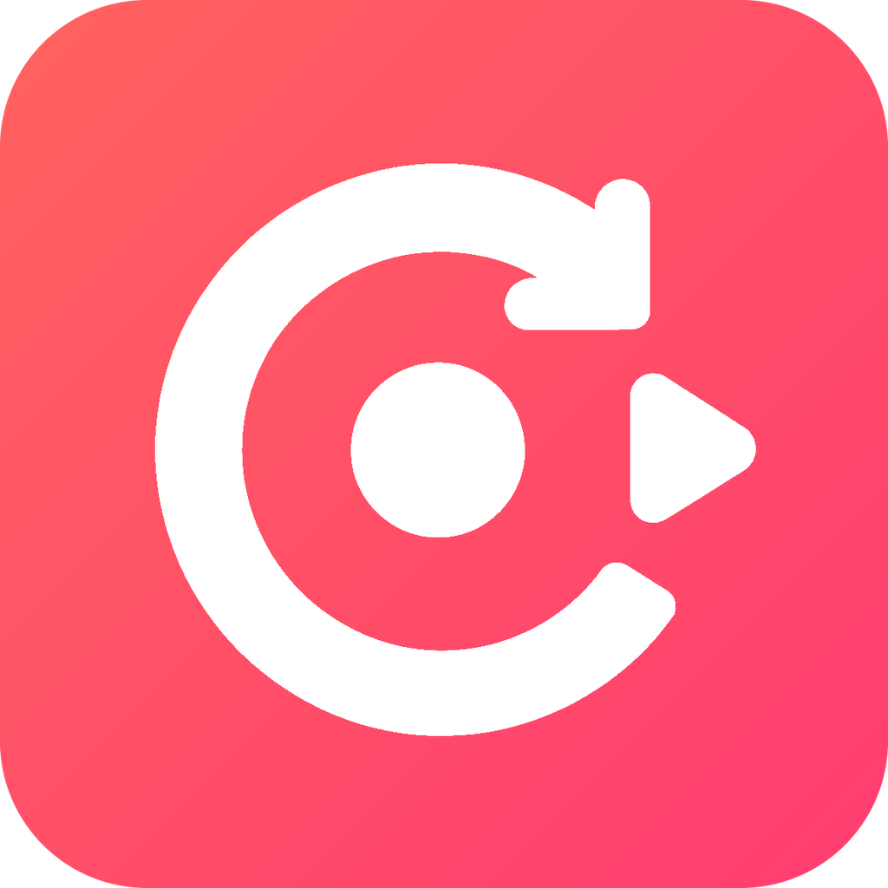
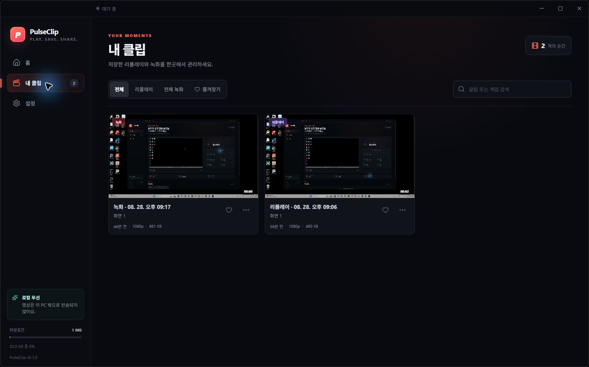
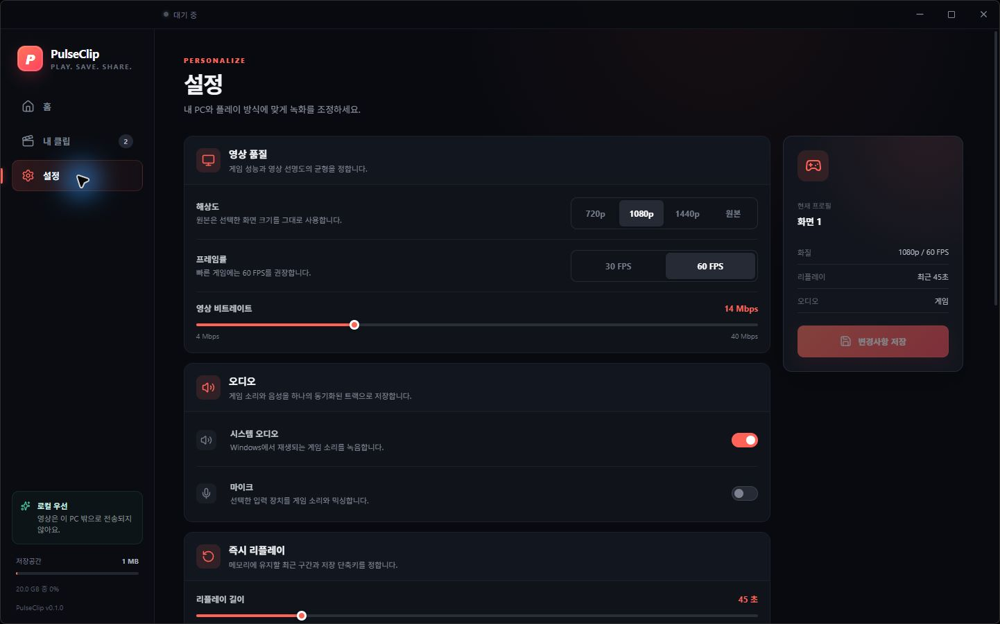
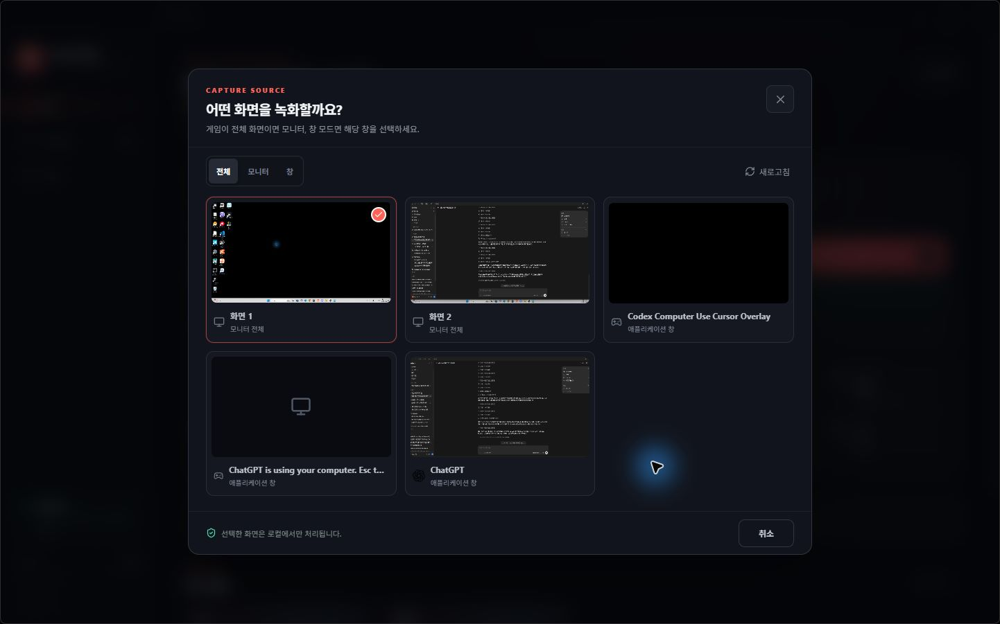
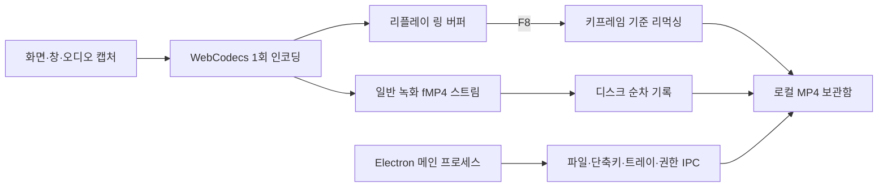

<div align="center">
  
  <h1>PulseClip</h1>
  <p><strong>플레이에 집중하세요. 명장면은 F8로 남기세요.</strong></p>
  <p>계정 가입이나 클라우드 업로드 없이, 바로 전 플레이를 내 PC에 저장하는 무료 Windows 게임 녹화 앱</p>

  <p>
    <a href="https://github.com/kwakhyun/pulseclip/releases/latest"></a>
    <a href="https://github.com/kwakhyun/pulseclip/actions/workflows/ci.yml"></a>
    <a href="LICENSE"></a>
    
  </p>

  <p>
    <a href="https://kwakhyun.github.io/pulseclip/"><strong>공식 웹사이트</strong></a>
    · <a href="https://github.com/kwakhyun/pulseclip/releases/latest"><strong>Windows 다운로드</strong></a>
    · <a href="docs/PRODUCT.md">제품 기획</a>
    · <a href="docs/ARCHITECTURE.md">아키텍처</a>
    · <a href="docs/FEATURE_ROADMAP.md">로드맵</a>
    · <a href="PRIVACY.md">개인정보 처리방침</a>
  </p>
</div>


## 프로젝트 소개

PulseClip은 게임 중 녹화를 미처 시작하지 못해도 `F8`을 누르면 바로 전 45초를 MP4로 남길 수 있는 로컬 우선 데스크톱 앱입니다. 복잡한 방송 도구를 학습하지 않아도 화면과 오디오를 한 번 설정한 뒤 즉시 리플레이와 일반 녹화를 함께 사용할 수 있도록 설계했습니다.

단순한 UI 프로토타입이 아니라 제품 기획, Electron 데스크톱 앱, 미디어 파이프라인, 장애 복구, Windows 설치 파일, SEO 랜딩 페이지와 CI/CD까지 실제 배포 흐름을 end-to-end로 구현한 프로젝트입니다.

| 구분 | 내용 |
| --- | --- |
| 해결할 문제 | 녹화를 켜지 않아 명장면을 놓치는 문제, 복잡한 설정, 장시간 녹화의 메모리·저장 공간 부담 |
| 핵심 사용자 | 별도 방송 환경 없이 플레이를 빠르게 기록하고 싶은 Windows 게이머 |
| 핵심 경험 | 리플레이를 켜두고 장면이 지나간 뒤 `F8` → 바로 전 45초를 로컬 MP4로 저장 |
| 제품 원칙 | Replay-first · Local-first · Reliability-first |
| 구현 범위 | 제품 전략, UI/UX, 캡처·인코딩, 파일 복구, 보안 경계, 패키징, 랜딩 페이지, 자동 배포 |
| 현재 상태 | `v0.1.3` 공개 베타 · Windows 10 22H2 이상 및 Windows 11 · x64/Arm64 |

## 문제 정의와 제품 전략

기존 녹화 도구에서 반복되는 불편을 다음과 같이 정의했습니다.

- 결정적인 순간이 지나간 뒤에야 녹화를 켜지 않았다는 사실을 알게 됩니다.
- 방송용 도구는 설정 항목이 많아 단순한 클립 저장에도 학습 비용이 큽니다.
- 장시간 영상을 메모리에 쌓거나 화면을 중복 인코딩하면 게임 성능에 부담을 줍니다.
- 녹화 파일의 업로드 여부와 저장 공간 정책이 불명확하면 개인정보를 신뢰하기 어렵습니다.
- 장치 연결 해제나 저장 공간 부족이 발생하면 긴 녹화 전체를 잃을 수 있습니다.

그래서 기능 수보다 첫 녹화 성공률을 우선했습니다.

| Replay-first | Local-first | Reliability-first |
| --- | --- | --- |
| 이미 지나간 장면을 `F8` 한 번으로 저장 | 계정·광고·클라우드 업로드 없이 로컬 보관 | 녹화 전 진단, 저장 공간 보호, 장치 복구, 중단 파일 복구 |

## 핵심 사용자 흐름

1. 녹화할 화면 또는 게임 창과 시스템·마이크 오디오를 선택합니다.
2. 화질과 리플레이 길이를 확인한 뒤 `리플레이 켜기`를 실행합니다.
3. 명장면이 지나간 뒤 `F8`을 누르면 바로 전 45초가 MP4로 저장됩니다.
4. 긴 세션은 `F9`로 일반 녹화를 시작하고 종료합니다.
5. 내 클립에서 검색, 필터, 즐겨찾기, 재생, 파일 위치 열기, 삭제를 수행합니다.

## 제품 화면

<table>
  <tr>
    <td width="50%">
      
      <br />
      <strong>클립 라이브러리</strong><br />
      녹화와 리플레이를 한곳에서 검색·필터·관리합니다.
    </td>
    <td width="50%">
      
      <br />
      <strong>녹화 설정</strong><br />
      해상도, FPS, 비트레이트, 오디오와 리플레이 길이를 조정합니다.
    </td>
  </tr>
</table>

<details>
  <summary><strong>캡처 소스 선택 화면 보기</strong></summary>
  <br />
  
</details>

## 주요 기능

### 녹화와 즉시 리플레이

- 화면·창 선택과 실시간 미리보기
- H.264 우선 WebCodecs 인코딩과 AAC 오디오
- 15~180초 순환 리플레이와 `F8` 즉시 저장
- `F9` 일반 녹화와 append-only fragmented MP4 기록
- Windows 시스템 오디오와 선택적 마이크 믹싱
- 720p/1080p/1440p/원본, 30/60 FPS, 4~40 Mbps 설정

### 로컬 클립 관리

- 검색, 유형 필터, 즐겨찾기, 내장 플레이어
- 파일 위치 열기와 삭제
- 저장 공간 한도 기반 자동 정리
- 즐겨찾기·활성 녹화 파일 보호

### 녹화 신뢰성

- 코덱, 오디오, 저장 폴더, 단축키 상태를 확인하는 진단 센터
- 녹화 전 여유 공간 검사와 임계치 도달 시 안전 종료
- 캡처 소스·시스템 오디오·마이크 연결 해제 후 복구 시도
- 중단된 `.part` 파일 복구와 원자적 완료 처리
- 구조화 로그와 개인정보를 제외한 진단 보고서

### Windows 데스크톱 경험

- 전역 단축키, 시스템 트레이, 시작 프로그램 옵션
- x64·Arm64 NSIS 설치 프로그램
- 샌드박스 렌더러와 검증된 최소 IPC 브리지
- 영상과 오디오를 사용자가 지정한 로컬 폴더에만 저장

## 핵심 기술 설계

### 한 번 인코딩하고 두 가지 녹화 경험 제공

즉시 리플레이와 일반 녹화를 별도로 인코딩하지 않습니다. 캡처 트랙을 WebCodecs로 한 번만 인코딩한 뒤 동일한 패킷을 리플레이 링 버퍼와 일반 녹화 스트림에 전달합니다.



- 리플레이 링은 설정 길이와 키프레임 여유분에 필요한 인코딩 패킷만 보관합니다.
- `F8`을 누르면 목표 시점 이전의 가장 가까운 키프레임부터 타임스탬프를 다시 맞춰 MP4로 리먹싱합니다.
- 일반 녹화는 전체 영상을 RAM에 쌓지 않고 fragmented MP4를 디스크에 순차 기록합니다.
- 두 경로가 하나의 인코딩 결과를 공유해 중복 인코딩과 불필요한 메모리 증가를 피합니다.

### 실패를 전제로 한 저장 구조

| 위험 | 설계 대응 |
| --- | --- |
| 앱 또는 PC의 예기치 않은 종료 | 활성 파일을 `.part`로 기록하고 다음 실행에서 복구 시도 |
| 저장 공간 고갈 | 시작 전 여유 공간 확인, 예약 공간 경계에서 안전 종료 |
| 소스·오디오 장치 연결 해제 | 안정적인 ID와 이름을 이용한 재탐색, 기본 장치 폴백 |
| 손상된 설정 파일 | 스키마 검증, 범위 보정, 원자적 설정 저장 |
| 임의 파일·URL 접근 | 등록된 clip ID와 사용자가 승인한 폴더만 IPC에서 허용 |

### 로컬 우선 보안 경계

- Electron 렌더러의 Node 통합을 끄고 샌드박스를 활성화했습니다.
- 프로덕션 UI는 권한이 큰 `file://` 대신 경로 순회를 차단하는 전용 `pulseclip://app` 프로토콜로 제공합니다.
- 패키징 시 ASAR 무결성 검증을 켜고 Node 실행·환경 변수·디버거 우회 경로를 Electron 퓨즈로 차단합니다.
- preload에는 기능별 최소 타입 API만 노출합니다.
- 모든 IPC 발신 프레임과 인자를 검증합니다.
- 외부 탐색과 임의 URL 로드를 차단합니다.
- 캡처 요청 토큰은 한 번만 사용할 수 있고 10초 후 만료됩니다.
- 기본 설정에서 녹화 파일을 외부 서버로 전송하지 않습니다.

자세한 내용은 [아키텍처 문서](docs/ARCHITECTURE.md)와 [보안 원칙](docs/SECURITY.md)에서 확인할 수 있습니다.

## 기술 스택

| 영역 | 기술 |
| --- | --- |
| Desktop | Electron 44, electron-builder, NSIS |
| Frontend | React 19, TypeScript 7, Vite 8 |
| Media | WebCodecs, MediaBunny, MediaStream APIs |
| State & Contract | 타입 기반 IPC 계약, 설정 스키마 검증 |
| Quality | Vitest, TypeScript typecheck, npm audit |
| Delivery | GitHub Actions, GitHub Releases, GitHub Pages |

## 품질과 배포 자동화

`main` 브랜치와 Pull Request에서 데스크톱 앱과 랜딩 페이지를 각각 검증합니다.

- Windows 러너: 타입 검사 → 단위 테스트 → 프로덕션 빌드 → x64 패키징 → Electron 보안 퓨즈 검증 → 운영 의존성 감사
- Ubuntu 러너: 랜딩 페이지 빌드 → 호스팅 번들 테스트 → 운영 의존성 감사
- `main`의 랜딩 페이지 변경은 GitHub Pages에 자동 배포
- Windows 설치 파일은 x64·Arm64 NSIS 패키지로 생성

```powershell
npm run verify
```

위 명령은 타입 검사, Vitest 단위 테스트, Electron 메인·React 렌더러 프로덕션 빌드를 한 번에 실행합니다.

## 설치와 실행

### 일반 사용자

[최신 Windows 설치 파일](https://github.com/kwakhyun/pulseclip/releases/latest)을 내려받아 설치하세요.

- 지원 환경: Windows 10 22H2 이상, Windows 11
- 지원 아키텍처: x64, Arm64
- 기본 저장 위치: Windows `동영상/PulseClip`
- 로그 위치: Electron `userData/logs/pulseclip.log`

> [!IMPORTANT]
> `v0.1.3` 공개 베타는 아직 Authenticode로 서명되지 않았습니다. Windows SmartScreen 경고가 나타날 수 있으며, Release의 `SHA256SUMS.txt`로 파일 무결성을 확인할 수 있습니다.

### 개발 환경

Node.js 22 이상이 필요합니다.

```powershell
npm ci
npm run dev
```

검증과 패키징:

```powershell
npm run verify
npm run package
npm run dist
```

- `npm run package`: 설치 없이 실행 가능한 x64 앱을 `release/win-unpacked/`에 생성
- `npm run dist`: x64·Arm64 NSIS 설치 프로그램을 `release/`에 생성

## 저장소 구조

```text
src/main       파일, 트레이, 단축키, 권한, 보안 IPC
src/preload    샌드박스 렌더러용 최소 타입 브리지
src/renderer   React UI와 단일 인코딩 캡처 엔진
src/shared     공용 타입, IPC 계약, 설정 검증
docs           제품, 아키텍처, 보안, 릴리스 문서
landing        SEO 프리렌더 랜딩 페이지와 GitHub Pages 빌드
artifacts      UI 감사 전후 화면과 브랜드 산출물
```

## 프로젝트 문서

| 문서 | 내용 |
| --- | --- |
| [제품 기획](docs/PRODUCT.md) | 문제 정의, 핵심 흐름, v1 범위, 품질 목표 |
| [아키텍처](docs/ARCHITECTURE.md) | 프로세스 경계, 미디어 파이프라인, 저장·복구 구조 |
| [보안 원칙](docs/SECURITY.md) | 로컬 저장, IPC와 경로 검증, 공개 전 보안 게이트 |
| [개인정보 처리방침](PRIVACY.md) | 앱의 로컬 데이터, 보관·삭제, GitHub 배포 경계 |
| [기능 로드맵](docs/FEATURE_ROADMAP.md) | 사용자 가치와 구현 위험을 기준으로 한 P0~P2 우선순위 |
| [릴리스 가이드](docs/RELEASE.md) | 패키징, 코드 서명, 배포 전 검증 항목 |
| [UI/UX 감사](artifacts/ui-audit/README.md) | 주요 화면의 문제점, 우선순위, 개선 전후 근거 |
| [아이콘 시스템](assets/brand/PULSECLIP_ICON.md) | 전용 아이콘 제작 원칙과 플랫폼별 산출물 |

## 이 프로젝트에서 다룬 역량

- 사용자 문제를 기능 목록이 아닌 핵심 행동과 품질 목표로 번역하는 제품 설계
- 게임 녹화의 성능·메모리·파일 무결성 제약을 고려한 미디어 파이프라인 설계
- 장애 복구와 저장 공간 보호를 중심으로 한 신뢰성 엔지니어링
- Electron 프로세스 경계와 로컬 데이터 원칙을 적용한 데스크톱 보안
- 실제 사용 흐름을 기준으로 한 UI/UX 감사와 디자인 시스템 정리
- Windows 패키징, 공개 릴리스, SEO 랜딩 페이지, CI/CD까지 이어지는 제품 배포

## 다음 단계

- 신뢰된 코드 서명과 안전한 자동 업데이트 채널
- 게임 자동 감지와 게임별 녹화 프로필
- 재인코딩을 최소화한 로컬 클립 트리머
- Intel·NVIDIA·AMD 실기기 장시간 테스트 매트릭스
- 선택적 HDR·HEVC·AV1 성능 모드

PulseClip은 DRM 또는 보호된 콘텐츠의 캡처 우회를 지원하지 않습니다. 상세 우선순위와 완료 기준은 [기능 고도화 로드맵](docs/FEATURE_ROADMAP.md)을 참고하세요.

## 라이선스

PulseClip 소스는 [MIT License](LICENSE)로 제공됩니다. 번들되는 오픈소스 구성요소는 [THIRD_PARTY_NOTICES.md](THIRD_PARTY_NOTICES.md)에서 확인할 수 있습니다.
