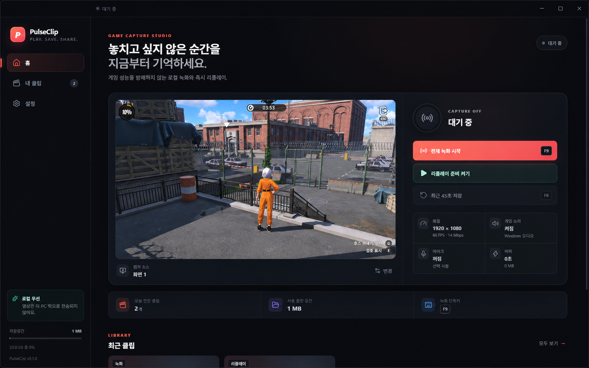
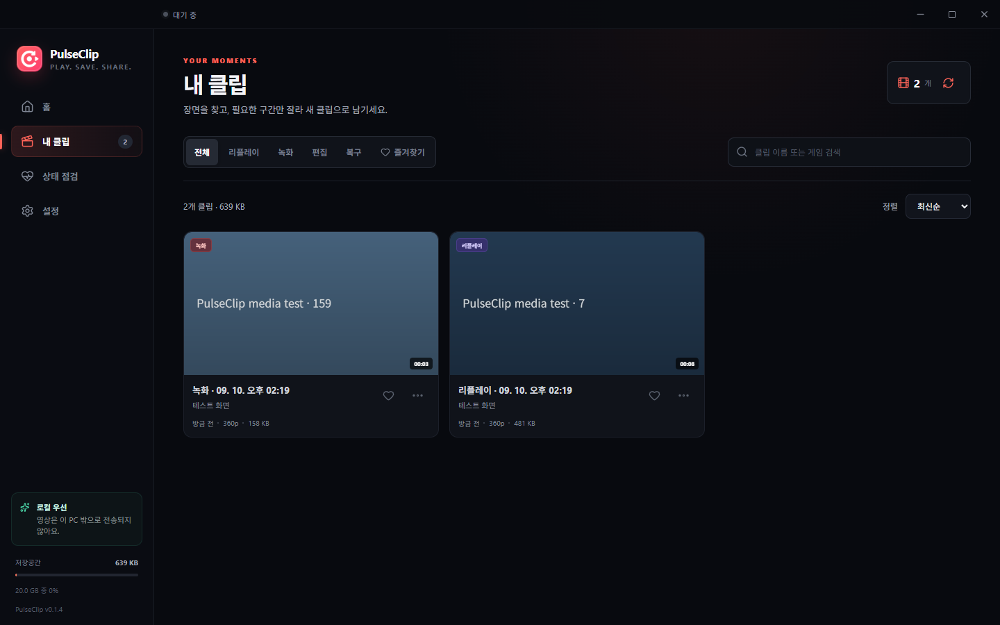
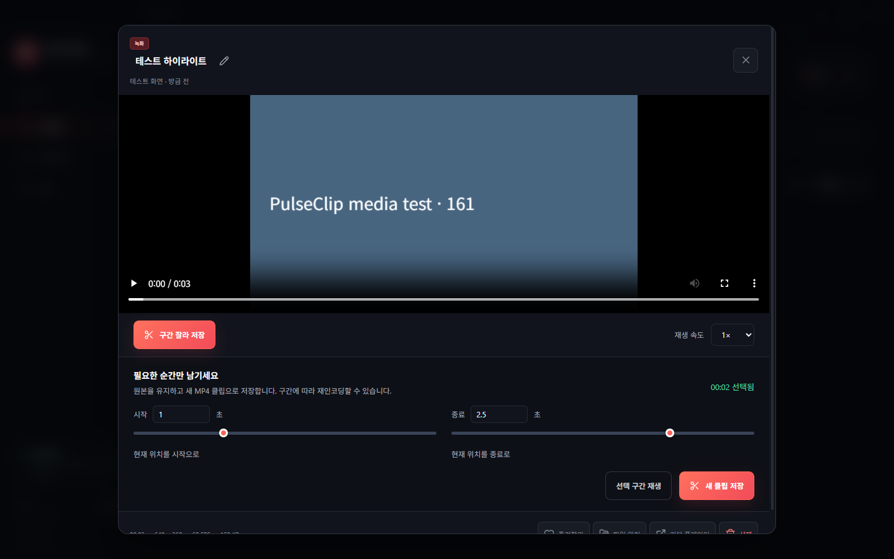
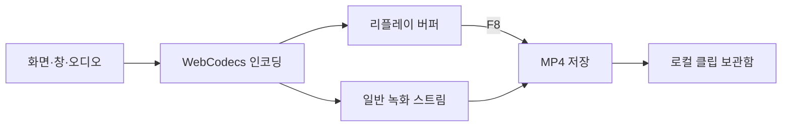

<div align="center">
  
  <h1>PulseClip</h1>
  <p><strong>플레이에 집중하세요. 명장면은 F8로 남기세요.</strong></p>
  <p>리플레이를 미리 켜두고, 최근 플레이를 내 PC에 MP4로 저장하는 무료 Windows 게임 녹화 앱</p>
  <p>
    <a href="https://github.com/kwakhyun/pulseclip/releases/latest"></a>
    <a href="https://github.com/kwakhyun/pulseclip/actions/workflows/ci.yml"></a>
    <a href="LICENSE"></a>
  </p>
  <p>
    <a href="https://kwakhyun.github.io/pulseclip/"><strong>공식 웹사이트</strong></a> ·
    <a href="https://github.com/kwakhyun/pulseclip/releases/latest"><strong>Windows 다운로드</strong></a> ·
    <a href="docs/FEATURE_ROADMAP.md">로드맵</a> ·
    <a href="PRIVACY.md">개인정보 처리방침</a>
  </p>
</div>

## 다운로드와 버전

| 구분 | 버전 | 이용 방법 |
| --- | --- | --- |
| 최신 공개 베타 | **v0.1.4** | [GitHub Releases](https://github.com/kwakhyun/pulseclip/releases/tag/v0.1.4)에서 설치 파일 다운로드 |
| 소스 코드 | **v0.1.4** | 공개 릴리스와 같은 버전. 직접 빌드 가능 |

공식 웹사이트에서 **v0.1.4 공개 베타**를 내려받을 수 있습니다. 구간 편집, 클립 이름 변경, 품질 프리셋과 녹화 안정성 개선이 포함됩니다.

- 지원 환경: Windows 10 22H2 이상 또는 Windows 11
- [x64 설치 파일](https://github.com/kwakhyun/pulseclip/releases/download/v0.1.4/PulseClip-0.1.4-x64-Setup.exe): Intel·AMD PC, 약 115 MB
- [Arm64 설치 파일](https://github.com/kwakhyun/pulseclip/releases/download/v0.1.4/PulseClip-0.1.4-arm64-Setup.exe): Windows on Arm PC, 약 109 MB
- [통합 설치 파일](https://github.com/kwakhyun/pulseclip/releases/download/v0.1.4/PulseClip-0.1.4-Setup.exe): PC 종류를 모를 때 선택, 약 223 MB

현재 공개 베타에는 코드 서명이 없어 Windows SmartScreen 경고가 나타날 수 있습니다. 공식 릴리스의 [SHA256SUMS.txt](https://github.com/kwakhyun/pulseclip/releases/download/v0.1.4/SHA256SUMS.txt)로 파일 무결성을 확인할 수 있습니다.

## 처음 사용하기

1. 앱에서 녹화할 화면이나 게임 창을 선택하고, 게임 소리와 마이크를 설정합니다.
2. **리플레이 켜기**를 누릅니다. 최근 구간을 임시로 보관하며, 기본 길이는 45초입니다.
3. 명장면이 지나간 뒤 **F8**을 눌러 MP4로 저장합니다. 길이는 15~180초로 변경할 수 있습니다.
4. 플레이 전체를 녹화하려면 **F9**로 일반 녹화를 시작하고 종료합니다. 리플레이와 함께 사용할 수 있습니다.
5. **내 클립**에서 재생, 검색, 즐겨찾기와 파일 관리를 이용합니다.

리플레이를 켜기 전의 장면은 저장할 수 없습니다. 켠 지 얼마 되지 않았다면 쌓인 구간만 저장되며, 키프레임 간격에 따라 실제 길이에 차이가 있을 수 있습니다. F8과 F9는 기본 단축키이며 설정에서 바꿀 수 있습니다.

기본 저장 위치는 Windows의 `동영상/PulseClip`입니다. 다른 폴더를 선택할 수 있으며, 계정 가입이나 영상 업로드는 필요하지 않습니다.



## 공개 베타 기본 기능

| 기능 | 제공 내용 |
| --- | --- |
| 녹화·리플레이 | 화면·창 선택, 15~180초 리플레이, 일반 녹화와 동시 사용 |
| 영상 설정 | 720p·1080p·1440p·원본 해상도, 30·60 FPS, 4~40 Mbps |
| 오디오 | Windows 시스템 오디오와 선택한 마이크 소리 혼합 |
| 클립 보관함 | 검색, 종류 필터, 즐겨찾기, 내장 재생, 파일 위치 열기와 삭제 |
| 저장 공간 관리 | 한도에 따라 오래된 클립 정리, 즐겨찾기와 녹화 중 파일 보호 |
| 상태 점검·복구 | 코덱·오디오·폴더·단축키 진단, 여유 공간 검사, 중단 파일 복구 시도 |
| Windows 연동 | 전역 단축키, 트레이, 시작 프로그램 설정, x64·Arm64 설치 파일 |

PC 성능과 게임에 따라 인코딩 부하가 달라질 수 있습니다. 복구는 남은 파일 상태에 따라 실패할 수 있으며, DRM 등 보호 기능을 우회하지 않습니다.

## v0.1.4에서 추가한 기능

- **구간 편집:** 시작·종료 시간을 선택해 새 MP4로 저장합니다. 원본 보존, 미리보기, 진행률과 취소를 지원합니다. 구간에 따라 재인코딩될 수 있습니다.
- **클립 관리:** 이름 변경, 0.5×~2× 재생, 날짜·용량·길이 정렬, 편집·복구 필터를 제공합니다.
- **설정:** 성능 우선·균형·선명하게 프리셋, 예상 용량, 자동 정리 선택, 미저장 변경 보호를 추가했습니다.
- **업데이트 확인:** 사용자가 요청하면 공식 GitHub 릴리스를 확인합니다. 자동 설치 방식은 아닙니다.
- **안정성:** 녹화 타임스탬프, 동시 저장, 설정 갱신 유실, 원본 보호, 대용량 영상의 범위 읽기를 개선했습니다.

<table>
  <tr>
    <td width="50%"><br /><strong>클립 보관함</strong></td>
    <td width="50%"><br /><strong>구간 편집</strong></td>
  </tr>
</table>

위 v0.1.4 화면은 합성 영상으로 녹화·편집을 검증한 실제 앱 캡처입니다. 자세한 수정 사항은 [v0.1.4 변경 내역](docs/RELEASE_NOTES_v0.1.4.md), 화면별 결과는 [품질 검토](docs/QUALITY_REVIEW_2026-09-10.md)를 참고하세요.

## 개발 환경

Node.js **22.12 이상**과 Windows가 필요합니다. 랜딩페이지는 다른 운영체제에서도 개발할 수 있습니다.

```powershell
npm ci
npm run dev
```

검증과 패키징은 다음 명령으로 실행합니다.

| 명령 | 내용 |
| --- | --- |
| `npm run verify` | 타입·미사용 코드 검사, 단위 테스트, 메인·렌더러 프로덕션 빌드 |
| `npm run test:desktop` | 빌드된 앱의 녹화·리플레이·편집·설정 통합 검사. 먼저 `npm run verify` 실행 |
| `npm run test:desktop -- --disable-accelerated-video-encode` | GPU 인코딩을 끈 상태의 장치 복구·녹화·편집 통합 검사. CI에서도 실행 |
| `npm run package` | 현재 호스트 아키텍처의 설치 없이 실행 가능한 앱 생성 |
| `npm run dist` | x64·Arm64 설치 파일과 체크섬 등 릴리스 산출물 생성 |

설치 파일은 `release/`에 생성됩니다. 데스크톱 통합 검사는 별도의 임시 폴더와 합성 화면·오디오를 사용하며, 사용자 화면·마이크를 녹화하지 않습니다.

현재 v0.1.4는 단위 테스트 **65개**, 실제 Electron의 녹화·동시 리플레이·구간 편집·취소·재생 시나리오, Windows x64 패키징을 로컬에서 검증했습니다. 실제 게임, 여러 GPU와 오디오 장치, 장시간 녹화, Arm64 실행은 별도로 검증해야 합니다.

## 구조와 미디어 처리

```text
src/main       파일 저장, 복구, 업데이트 조회, 트레이, 단축키, IPC
src/preload    샌드박스 렌더러에 노출하는 최소 API
src/renderer   components / hooks / capture / styles
src/shared     공용 타입, IPC 계약, 설정·입력 검증
scripts        빌드·패키징 검사와 데스크톱 통합 검사
docs           제품, 구조, 보안, 릴리스, 검토 문서
landing        한국어 랜딩페이지와 정적 호스팅 빌드
artifacts      실제 검증 화면과 디자인 참고 자료
```

Electron 44, React 19, TypeScript 7, Vite 8, MediaBunny를 사용합니다. 캡처 영상과 오디오를 한 번 인코딩하고, 같은 패킷을 리플레이 버퍼와 일반 녹화에 전달합니다.



일반 녹화는 전체 영상을 메모리에 쌓지 않고 fragmented MP4로 순차 기록합니다. 진행 중 파일은 `.part`로 보관하고, 완료하면 이름을 바꿉니다. 렌더러의 Node 통합은 끄고, 검증된 IPC와 전용 미디어 프로토콜을 통해 파일에 접근합니다.

설정은 Electron `userData` 폴더, 로그는 `app.getPath('logs')/pulseclip.log`에 저장합니다. Windows 기본 경로는 `%APPDATA%/PulseClip`과 그 아래 `logs` 폴더입니다. 자세한 저장·권한 경계는 [아키텍처](docs/ARCHITECTURE.md)와 [개인정보 처리방침](PRIVACY.md)에 설명되어 있습니다.

## 랜딩페이지와 배포

[랜딩페이지 개발 안내](landing/README.md)에 실행과 검증 방법을 정리했습니다. 공개 설치 버전과 다운로드·검색 메타데이터는 `landing/src/release.js`에서 함께 관리합니다. 새 릴리스의 파일을 공개한 뒤 해당 정보와 기능 안내를 갱신합니다.

- `main`과 Pull Request에서 데스크톱과 랜딩페이지 품질 검사를 실행합니다.
- `main`의 랜딩페이지 변경은 GitHub Pages에 자동 배포합니다.
- 소스를 푸시하는 것만으로 Windows 설치 파일이 새 릴리스로 공개되지는 않습니다.

## 프로젝트 문서

| 문서 | 내용 |
| --- | --- |
| [제품 기획](docs/PRODUCT.md) | 사용자 문제와 핵심 흐름 |
| [아키텍처](docs/ARCHITECTURE.md) | 미디어 처리, 파일 저장, 프로세스 경계 |
| [보안 원칙](docs/SECURITY.md) · [개인정보 처리방침](PRIVACY.md) | 권한, 로컬 데이터, 네트워크 사용 |
| [로드맵](docs/FEATURE_ROADMAP.md) | 완료한 기능과 다음 개발 범위 |
| [릴리스 가이드](docs/RELEASE.md) | 패키징, 서명, 배포 전 검사 |
| [v0.1.4 변경 내역](docs/RELEASE_NOTES_v0.1.4.md) | 최신 공개 베타의 추가 기능과 수정 사항 |
| [앱 품질 검토](docs/QUALITY_REVIEW_2026-09-10.md) | 실제 앱의 화면별 검증 결과 |
| [README·랜딩 검토](docs/LANDING_REVIEW_2026-09-10.md) | 문구·버전 정합성·반응형 개선 결과 |

게임 자동 감지, 이벤트 기반 자동 하이라이트, 다중 오디오 트랙과 서명 기반 자동 설치 업데이트는 아직 제공하지 않습니다.

## 라이선스

소스는 [MIT 라이선스](LICENSE)로 제공합니다. 번들된 오픈소스 구성요소는 [오픈소스 고지](THIRD_PARTY_NOTICES.md)를 참고하세요.
