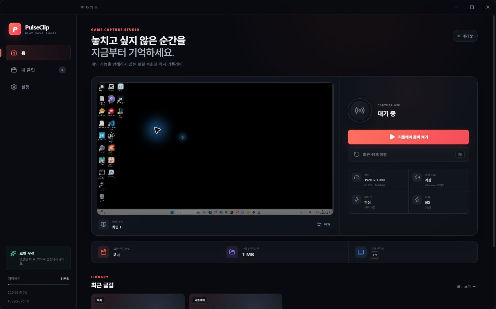
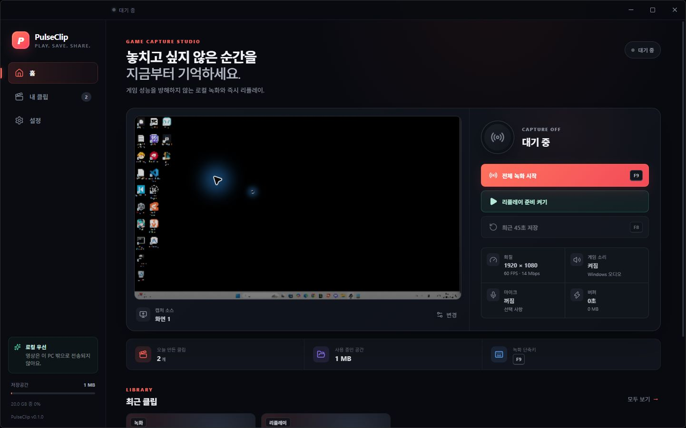
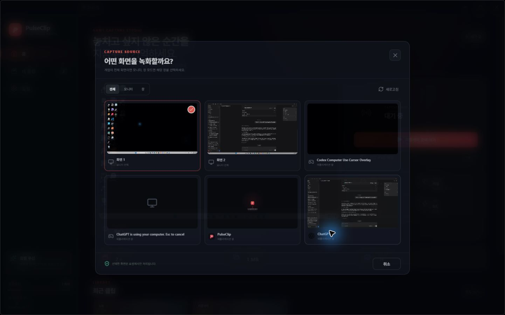
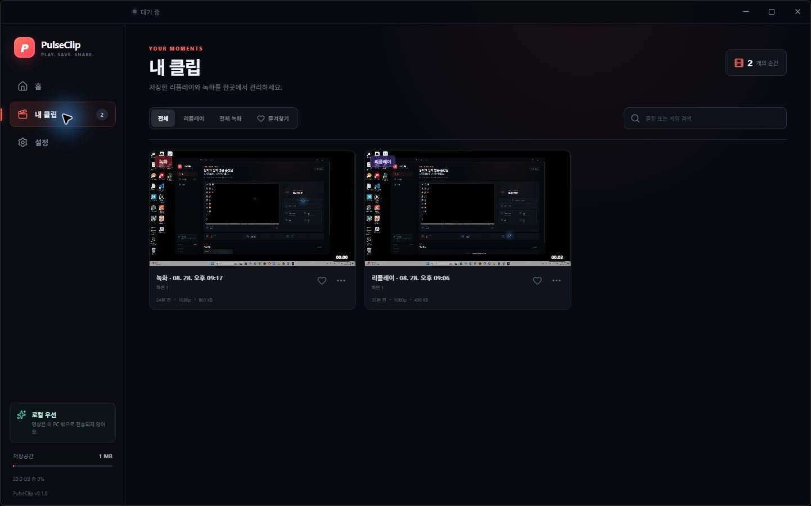
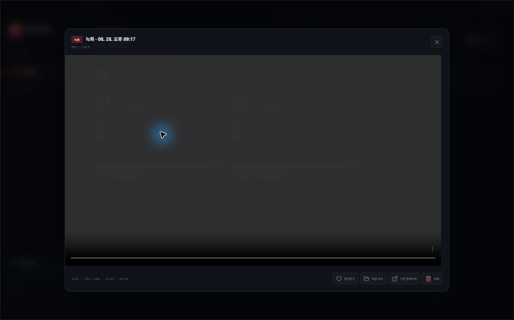
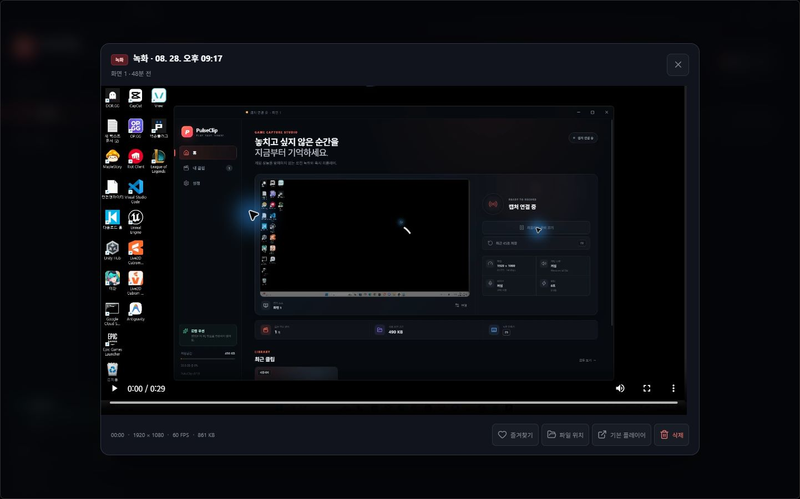
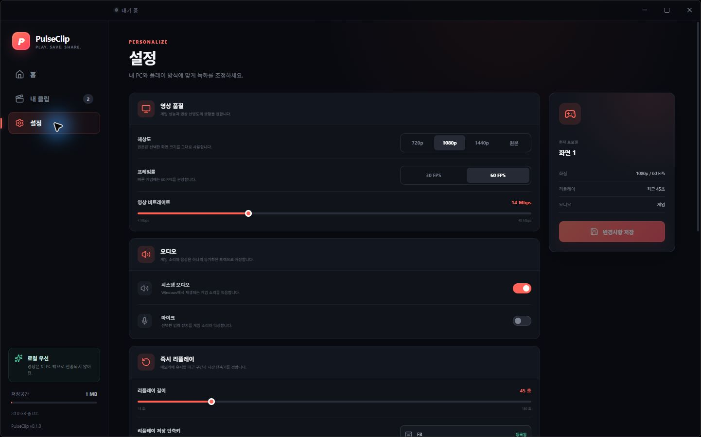
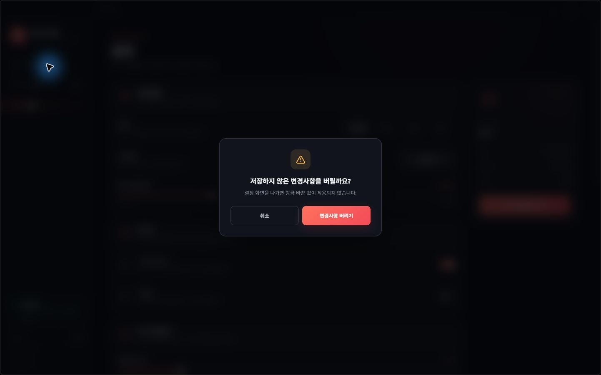

# PulseClip 디자인·UI/UX 감사 및 개선 결과

- 감사 대상: Windows 데스크톱 앱 PulseClip v0.1.0
- 검증 해상도: 1442 × 901
- 검증 방식: 실제 패키징 실행본의 화면 비교, 접근성 트리 확인, 키보드 `Tab`/`Escape` 조작, 핵심 상태 전환 테스트

## 결과 요약

| 단계 | 핵심 작업 | 개선 전 상태 | 개선 후 상태 | 건강도 |
| --- | --- | --- | --- | --- |
| 1 | 홈에서 전체 녹화와 리플레이 버퍼 시작 | 두 행동의 시각적 위계가 약하고 원형 아이콘의 의미를 추론해야 함 | `전체 녹화 시작`을 명시적 주 CTA로, `리플레이 준비`를 별도 상태 버튼으로 분리 | 양호 |
| 2 | 캡처 소스 선택 | 모달 키보드 종료·포커스 규칙이 없고 PulseClip 자체 창이 후보에 포함됨 | 초기 포커스, 포커스 트랩, `Escape`, 포커스 복귀를 추가하고 자체 창을 후보·선택 경로에서 차단 | 양호 |
| 3 | 내 클립 검색·필터·메뉴 | 작은 본문/컨트롤, 필터 의미 노출 부족, 메뉴가 외부 클릭·`Escape`로 닫히지 않음 | 가독성, 토글 의미, 명확한 레이블, 외부 클릭·`Escape` 종료를 개선 | 양호 |
| 4 | 클립 플레이어 열기·관리 | 대화상자 이름·포커스·키보드 종료가 불완전 | 대화상자 레이블, 포커스 관리, `Escape`, 즐겨찾기 상태 노출을 추가 | 양호 |
| 5 | 설정 변경·저장 | 선택 상태가 보조기기에 명확하지 않고 저장 전 이탈 시 변경이 조용히 사라짐 | `aria-pressed`, 단축키 유효성 상태와 `저장 시 적용` 안내를 추가 | 양호 |
| 6 | 미저장 설정을 둔 채 이동 | 손실 방지 장치 없음 | 취소를 기본 포커스로 둔 미저장 변경 경고 추가 | 양호 |

## 우선순위별 발견사항과 조치

### P0 — 핵심 과업 실패·데이터 손실 위험

- **자체 창 캡처 루프:** 캡처 소스에서 PulseClip 창을 제외하고 메인 프로세스에서도 재검증해 우회 선택을 막았다.
- **설정 변경 손실:** 변경 후 다른 화면으로 이동하면 확인 대화상자를 표시하고, 취소 시 설정 화면과 값이 유지되도록 했다.
- **모달 키보드 이탈:** 소스 선택기·플레이어·확인창에 포커스 트랩, `Escape`, 종료 후 포커스 복귀를 공통 적용했다.

### P1 — 사용성·접근성·오조작 위험

- **녹화 행동 위계:** 전체 녹화를 가장 강한 버튼으로 올리고 리플레이 준비/저장과 분리했다.
- **저가독성 UI:** 7–10px 중심의 작은 텍스트를 10–13px 범위로 조정하고 보조 텍스트 대비와 컨트롤 높이를 높였다.
- **초점 가시성:** 키보드 포커스에 3px 고대비 링과 외곽광을 적용했다.
- **상태 의미:** 탐색에는 `aria-current`, 토글에는 `aria-pressed`, 알림에는 `status`/`alert`, 검색과 아이콘 버튼에는 명시적 레이블을 적용했다.
- **클립 메뉴 수명주기:** 메뉴 외부 클릭과 `Escape`에서 닫히도록 하고, 재생 미리보기는 모션 축소 설정을 따른다.
- **애니메이션 민감도:** `prefers-reduced-motion`에서 전환과 반복 애니메이션을 비활성화했다.

### P2 — 후속 고도화 후보

- 200% 확대, Windows 고대비 모드, Narrator/NVDA로 전체 흐름을 별도 검증한다.
- 실제 게임·HDR·다중 모니터·DPI 조합별 캡처 소스 썸네일과 긴 제목 잘림을 매트릭스 테스트한다.
- 빈 보관함, 저장공간 임계치, 녹화 실패, 장치 분리 상태의 전용 시각 회귀 테스트를 추가한다.
- 설정 페이지에 `변경사항 있음` 표식을 상시 노출해 경고 이전에도 저장 필요 상태를 더 분명히 알린다.

## 화면 증거

### 1. 홈

개선 전:

개선 후:

### 2. 캡처 소스 선택

개선 전:

개선 후:

PulseClip 자체 창이 캡처 후보에서 제외되었고, 키보드 포커스 링과 `Escape` 종료를 확인했다.

### 3. 내 클립

개선 전:

개선 후:

### 4. 플레이어

개선 전:

개선 후:

### 5. 설정

개선 전:

개선 후:

### 6. 미저장 변경 보호

## 검증 범위와 한계

- 실제 실행본에서 홈 → 소스 선택 → 내 클립 → 플레이어 → 설정 → 미저장 이탈 경고 흐름을 검증했다.
- 소스 선택기·플레이어의 `Escape` 종료, 클립 메뉴의 외부 클릭/`Escape` 종료, 시각적 키보드 포커스를 확인했다.
- 자체 창은 UI 목록과 메인 프로세스 승인 경로에서 모두 차단했다.
- 이 감사는 제품 수준 휴리스틱·키보드 검증이며 WCAG 적합성 인증은 아니다. 스크린 리더, 200% 확대, 고대비 및 색각 시뮬레이션은 후속 전문 접근성 QA 범위다.

## 최종 빌드 검증

- TypeScript 검사: 통과
- Vitest: 1개 파일, 3개 테스트 모두 통과
- Vite 프로덕션 빌드: 통과
- Electron Builder NSIS: Windows x64·ARM64 설치 프로그램 생성 완료
- SHA-256: `release/SHA256SUMS.txt`에 기록
- 코드 서명: 개발용 산출물은 서명되지 않았다. 외부 상용 배포 전 조직 명의 코드 서명 인증서와 평판 축적 절차가 필요하다.
