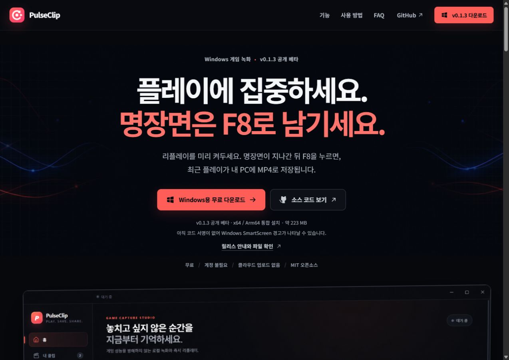
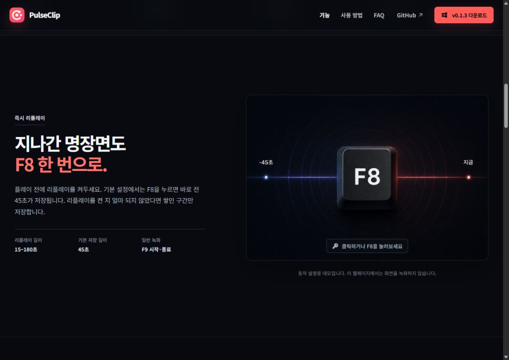
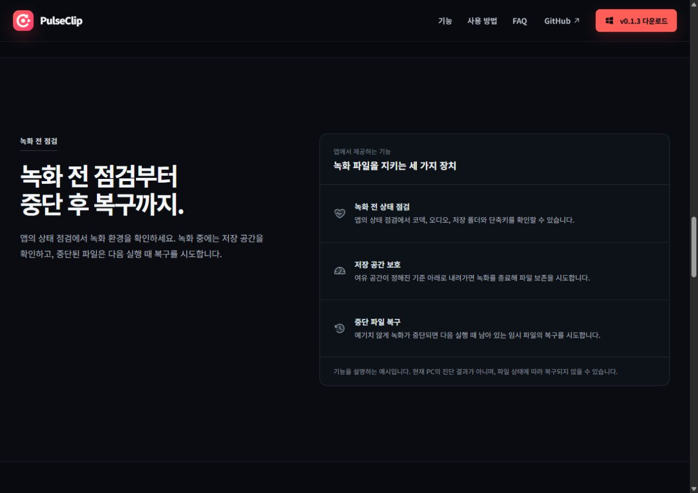
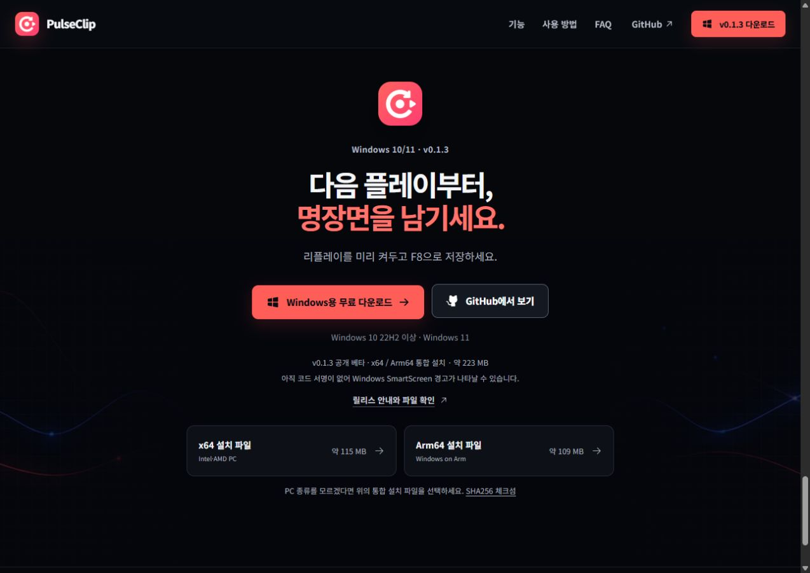
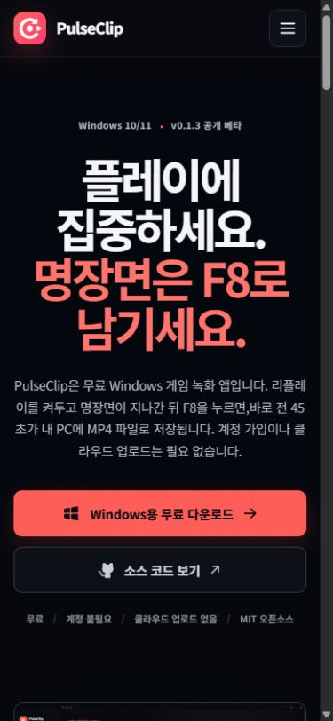
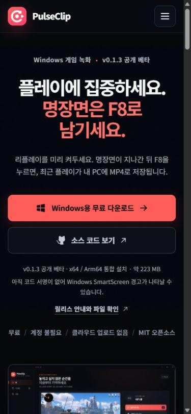

# README·랜딩페이지 검토 · 2026-09-10

현재 소스와 공개 GitHub 릴리스, 로컬 프로덕션 랜딩페이지를 비교했다. 공개 설치 파일은 v0.1.3이며, 현재 개발 소스는 v0.1.4다. 소스 푸시는 설치 파일의 새 릴리스 공개와 별개다.

## 수정한 정합성 문제

- README의 공개 기능과 개발 기능이 섞여 있어 별도 표와 섹션으로 나눴다. 다운로드·설치·첫 사용 정보를 문서 앞에 배치하고 반복되는 소개와 자기평가성 표현을 줄였다.
- 리플레이를 켜기 전 장면도 저장할 수 있는 것처럼 읽히는 문구를 수정했다. 기본 45초, 설정 범위 15~180초, 버퍼가 짧으면 쌓인 구간만 저장된다는 조건을 명시했다.
- 이전 앱 화면은 v0.1.3 예시로 표시했다. README의 개발 기능에는 실제 v0.1.4 통합 검사 화면을 사용하고 합성 테스트 영상임을 설명했다.
- 웹페이지의 ‘3개 항목 정상’, ‘녹화 가능’, ‘작동 중’은 실제 방문자 PC의 검사 결과가 아니므로 제거했다. 상태 점검·공간 보호·복구 기능을 설명하고 복구 한계를 적었다.
- 다운로드 옆에 공개 버전, 파일 크기, 코드 서명 상태와 릴리스 안내를 표시했다. 하단에는 x64·Arm64 개별 파일과 체크섬 링크를 추가했다.
- 개인정보 안내가 보안 문서만 가리키던 링크를 실제 개인정보 처리방침으로 바꿨다. 로컬 파일 예시는 실제 파일명인 것처럼 보이지 않게 정리했다.
- 공개 버전·설치 URL·파일 크기·설명·JSON-LD를 `landing/src/release.js`로 모았다. 개발 버전은 루트 `package.json`에서 읽는다. HTML 메타데이터와 화면의 버전·링크 일치를 빌드 결과로 검사한다.
- JavaScript 없이도 프리렌더된 다운로드와 FAQ를 이용할 수 있으므로, JavaScript가 반드시 필요하다는 기존 안내를 바로잡았다.

## 사용자 흐름과 화면

### 1. 첫 방문과 제품 이해 — 개선 후 정상

기존 파형·코랄 강조색·게임 미리보기를 유지했다. 제목 크기와 상단 여백을 조정하고 소개를 두 문장으로 줄였다. 다운로드 파일의 조건을 버튼 가까이에서 확인할 수 있다.

### 2. 리플레이 이해와 사용 방법 — 개선 후 정상

기본 길이와 사전 활성화 조건을 명확히 했다. 내부 구현 설명인 ‘인코딩 횟수 1회’ 대신 사용자에게 필요한 기본 길이와 일반 녹화 F9를 안내한다. 웹 데모는 실제 녹화와 구분하고, 버튼 클릭 후 피드백이 나타나는지 확인했다.

### 3. 저장과 녹화 안정성 — 개선 후 정상

현재 PC를 검사한 것처럼 보이는 상태 배지를 기능 설명으로 바꿨다. 작은 보조 문구를 확대하고, 회색 설명의 대비를 높였다. 자동 복구를 보장하는 표현을 제거했다.

### 4. FAQ와 설치 파일 선택 — 개선 후 정상

SmartScreen과 개발 버전의 편집 기능을 FAQ에 추가했다. FAQ 펼침, 버전별 링크, 통합·x64·Arm64·체크섬 URL을 확인했다. 설치 파일명과 크기는 GitHub API의 실제 공개 자산 목록과 비교했다.

### 5. 모바일 읽기와 메뉴 — 개선 후 정상

기존 메뉴를 열고 Tab을 누르면 배경 다운로드 링크로 포커스가 이동했다. 메뉴 내부 포커스 순환, Escape 닫기, 토글로 포커스 복원, 배경 비활성화, 데스크톱 너비로 전환할 때 메뉴 닫기를 적용했다. 좁은 화면의 제목과 문장 줄바꿈도 다듬었다.

| 개선 전 | 개선 후 |
| --- | --- |
|  |  |

## 검증

- 랜딩 프로덕션 빌드, 프리렌더, 정적 호스팅·다운로드·메타데이터·로컬 이미지 검사 8개 통과.
- 브라우저에서 320·390px 모바일, 768px 태블릿, 데스크톱 레이아웃을 확인했다. 가로 넘침, 메뉴 키보드 이동, Escape 복원, FAQ, 데모와 링크를 점검했다.
- 프로덕션 페이지의 브라우저 오류·경고 없음. 운영 의존성 보안 감사에서 취약점 0개.
- 데스크톱 타입 검사와 65개 단위 테스트 통과. Windows 테스트 종료 시 로그 쓰기를 기다리지 않던 임시 폴더 정리 경합도 수정했다.

스크린리더, 모든 브라우저·DPI, 실제 Windows 설치 과정 전체의 접근성·호환성을 보장하는 검사는 아니다. 이번 작업에서 새 Windows 릴리스나 코드 서명은 발급하지 않았다.
