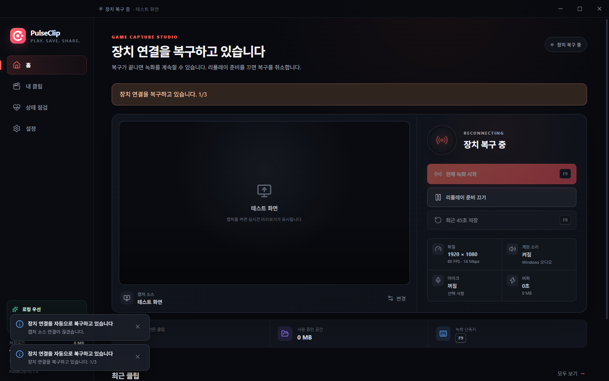
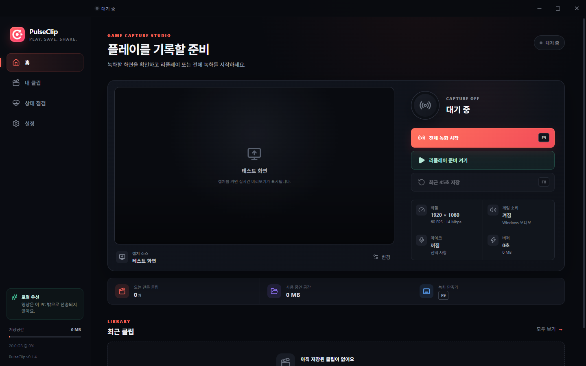
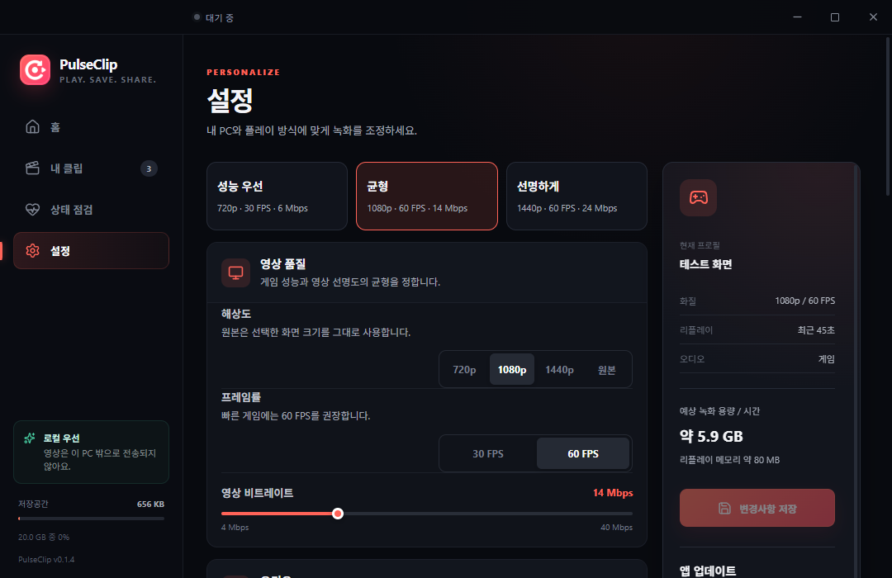
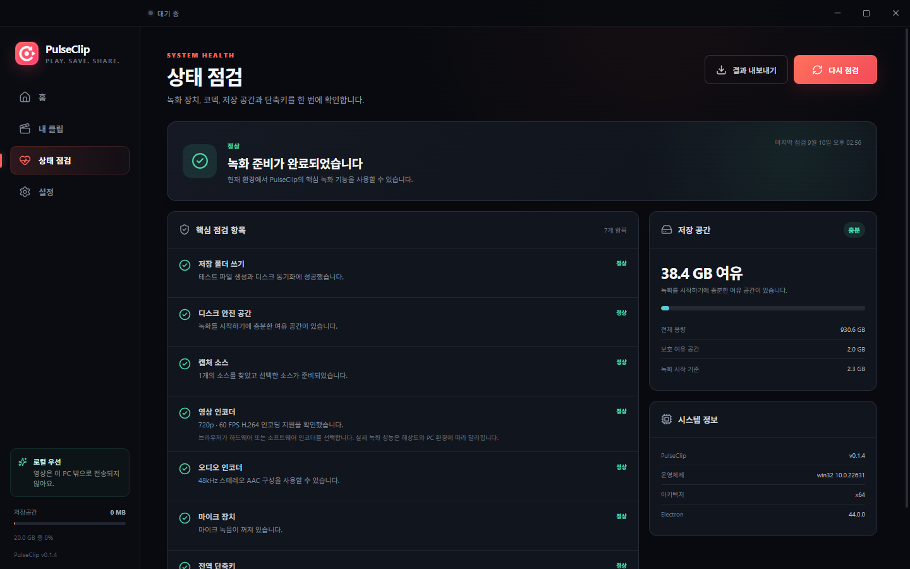

# 프로젝트 품질 검토 · 2026-09-10

검토 대상: PulseClip 데스크톱 녹화 앱과 보조 랜딩 페이지. 기준 버전 0.1.3 → 개선 빌드 0.1.4.

## 확인 방법

소스·타입/IPC 경계·파일 쓰기·복구·저장 한도·설정·React 화면을 검토했다. 기존 단위 테스트 44개에서 총 65개로 늘리고 실제 Electron 시나리오를 추가했다. UI 캡처는 이 검토에서 직접 실행한 Electron 창에서 생성했다. 테스트 소스는 합성 영상과 오디오이며 실제 사용자 화면·마이크는 녹화하지 않았다.

합성 오디오는 물리적 출력 장치 없이 동작하는 AudioContext를 명시적으로 시작한다. 녹화 통합 검사가 CI에서 실패하면 합성 영상 프레임 수·오디오 상태·트랙 상태와 격리된 앱 로그를 출력한다.

CI에서 발견한 인코더 선택 오류는 로컬에서 `--disable-accelerated-video-encode`로 재현했다. 지원 검사와 실제 인코더 설정을 일치시켜 GPU 인코딩이 없는 환경에서도 녹화할 수 있도록 수정했다. 통합 검사에는 소스 연결 끊김에 따른 자동 복구와 복구 중 버튼 비활성화도 포함한다.

첫 영상·오디오 패킷 수신 전에 준비 완료를 표시하던 문제도 수정했다. 초기화 오류를 시작 실패로 처리하며, 장치 복구 후 실제 녹화·리플레이·편집까지 이어지는지 검증한다.

## 사용자 흐름별 결과

1. **홈과 캡처 준비 — 개선 후 정상.** 선택된 소스가 있는데도 다시 선택하라는 안내를 고쳤다. 상태별 제목과 다음 행동을 표시한다. 실제 녹화에서는 이중 FPS 보정으로 발생하던 타임스탬프 역전도 제거했다.

   

2. **보관함과 검색 — 개선 후 정상.** 빈 화면에서 녹화로 돌아갈 수 있다. 검색·종류 필터·정렬·결과 용량을 제공한다. 24개씩 표시하고 화면 밖 영상 로딩을 줄인다. 썸네일에는 합성 테스트 영상이 표시되어 있다.

   

3. **재생과 편집 — 새로 구현, 시나리오 통과.** 이름 변경, 재생 속도, 구간 미리보기, 새 MP4 저장과 취소를 제공한다. 1~2.5초 구간을 내보내 1.5초 MP4로 재생되는지 검사했다. 원본 파일 수와 보존 여부도 확인했다.

   

4. **설정 — 개선 후 정상.** 품질 프리셋, 용량 추정, 자동 정리 선택, 커서 표시와 업데이트 확인을 추가했다. 미저장 변경을 보존하고 잘못된/중복 단축키 저장을 막는다. 최소 창 1080×700에서 가로 넘침을 검사했다.

   

5. **진단 — 기존 흐름 유지, 진입/실행 정상.** 실제 GPU 모델이나 모든 장치 조합을 검사하는 것은 아니며 기존 코덱/폴더/단축키 진단을 유지했다.

   

## 정리 내역

통합 대화상자 소스를 독립 컴포넌트로 옮겨 기존 파일을 제거했다. 일반 녹화 writer, IPC 청크 sink, 편집, 포커스, 검색·정렬과 CSS를 책임별로 분리했다. 참조가 없던 이전 SVG 아이콘과 랜딩 스크린샷 JPG를 제거했다. 문서에서 참조하는 이전 감사/디자인/브랜드 이미지는 유지했다. 작업 시작 때 존재한 `artifacts/captures` 사용자 파일도 삭제하지 않았다.

## 확인 범위의 한계

키보드 포커스와 최소 창 배치를 점검했지만 스크린리더·고대비·다양한 DPI 전체에 대한 접근성 인증을 의미하지 않는다. 실제 게임·다중 모니터·실제 루프백/마이크·장시간 녹화·절전·Arm64·다양한 GPU 실기기 검증은 별도로 필요하다. 설치 파일의 Authenticode 서명과 자동 설치 업데이트는 이번 작업에 포함되지 않는다.

상세 결함과 재현·수정 범위는 [v0.1.4 변경 내역](RELEASE_NOTES_v0.1.4.md), 구조는 [아키텍처](ARCHITECTURE.md)를 참고한다.
